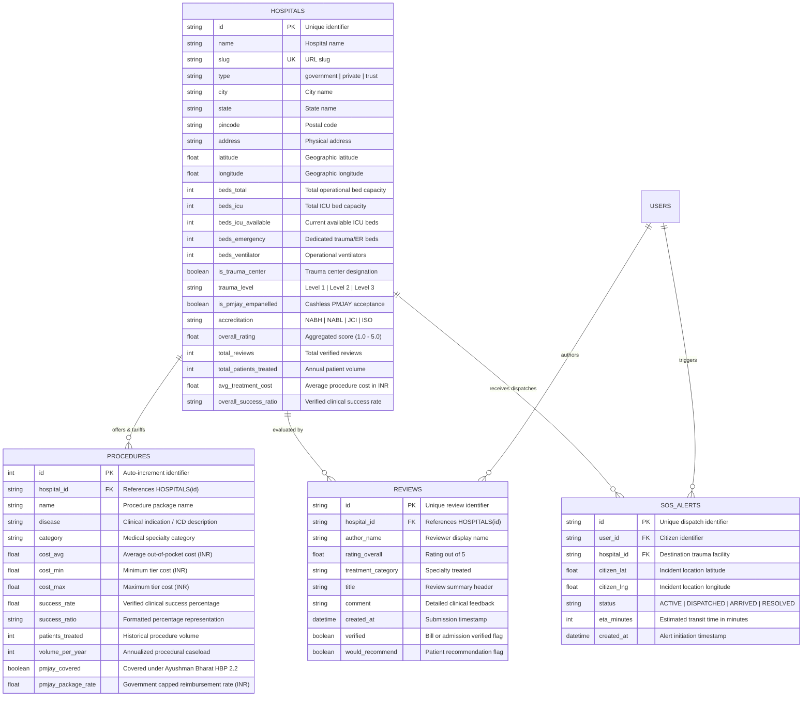

# Med Route — Database Architecture and Data Catalog

Technical specification of the relational database schema, entity relationships, clinical data models, dataset provenance, and access interfaces for the Med Route platform.

---

## 1. Dataset Overview and Scope

The Med Route data layer is a normalized, clinical-grade registry covering primary, secondary, tertiary, and quaternary healthcare institutions across India. Pricing schedules and procedural classifications are structured to align directly with the **National Health Authority (NHA)** and **Ayushman Bharat (AB-PMJAY HBP 2.2)** benefit standards.

| Dimension | Volume | Description |
|---|---|---|
| **Registered Facilities** | 1,451 Institutions | Verified government, private, and charitable trust medical centers |
| **Geographic Coverage** | 107 Cities | Nationwide coverage with primary density across Tricity (Chandigarh, Mohali, Panchkula), Punjab, Haryana, and NCR |
| **Monitored ICU Bed Capacity** | 91,398 Total Beds | Comprehensive tracking across general ICU, cardiac care (CCU), neonatal (NICU), and emergency trauma units |
| **Real-Time Available ICU Beds** | 10,880 Active Units | Live bed telemetry tracking available capacity across registered institutions |
| **Verified Procedure Tariffs** | 8,481 Package Tariffs | Transparent package pricing, annual procedural volume, and clinical outcome benchmarks |
| **PMJAY Empanelled Facilities** | 1,087 Facilities (74.9%) | Hospitals verified for cashless Ayushman Bharat golden card processing |
| **Patient Outcome Reviews** | 4,350+ Clinical Reviews | Verified patient feedback, wait times, departmental ratings, and recommendation scores |

---

## 2. Entity-Relationship Architecture

The following diagram illustrates the relational data model connecting healthcare institutions, clinical procedures, verified reviews, emergency telemetry dispatches, and user accounts.



---

## 3. Relational Schema Definitions and ORM Models

The application manages data persistence using **SQLAlchemy 2.0** with asynchronous engines and schema migrations via **Alembic**. The ORM definitions reside in the [`backend/app/models/`](backend/app/models/) directory:

- [`backend/app/models/hospital.py`](backend/app/models/hospital.py): Facility identity, geographic coordinates, bed telemetry, trauma classification, and quality accreditations.
- [`backend/app/models/hospital_procedure.py`](backend/app/models/hospital_procedure.py): Association table mapping facilities to procedural tariffs, annual volume, and clinical outcome metrics.
- [`backend/app/models/procedure.py`](backend/app/models/procedure.py): Standardized dictionary of surgical and medical packages.
- [`backend/app/models/review.py`](backend/app/models/review.py): Validated patient ratings and departmental clinical feedback.
- [`backend/app/models/sos_alert.py`](backend/app/models/sos_alert.py): Real-time emergency ambulance dispatch telemetry.

### Indexing Strategy

To support sub-50ms query latency during high-concurrency requests and emergency routing, the following database indices are defined:
1. **Spatial GiST Index**: Applied to `(latitude, longitude)` on the `hospitals` table to enable efficient bounding-box and radius queries.
2. **Compound Index on Clinical Attributes**: Indexed on `(city, type, is_pmjay_empanelled)` for fast directory filtering.
3. **Foreign Key Indexing**: Indexed on `procedures(hospital_id)` and `reviews(hospital_id)` to optimize relational joins during hospital profile assembly.
4. **Unique Constraint**: Unique index on `hospitals(slug)` for deterministic URL resolution.

---

## 4. Representative Records

### Public Apex Tertiary Center: PGIMER Chandigarh
```json
{
  "id": "hosp-1",
  "name": "PGIMER Chandigarh",
  "slug": "pgimer-chandigarh",
  "type": "government",
  "city": "Chandigarh",
  "state": "Chandigarh",
  "latitude": 30.7650,
  "longitude": 76.7810,
  "beds_total": 1948,
  "beds_icu": 220,
  "beds_icu_available": 14,
  "beds_emergency": 120,
  "is_trauma_center": true,
  "trauma_level": "Level 1",
  "is_pmjay_empanelled": true,
  "accreditation": "NABH Digital & NABL Accredited",
  "overall_rating": 4.8,
  "total_reviews": 642,
  "cost_range": "100% Free with PMJAY (INR 15,000 – INR 45,000 subsidized)",
  "specialties": [
    "Emergency & Trauma",
    "Heart Care",
    "Nephrology & Kidney Care",
    "Bone & Joint",
    "Oncology & Cancer Care"
  ],
  "sample_procedure": {
    "name": "Coronary Artery Bypass Graft (CABG)",
    "cost_avg": 45000,
    "pmjay_package_rate": 130000,
    "pmjay_covered": true,
    "volume_per_year": 1250,
    "success_ratio": "98.4%"
  }
}
```

### Private Quaternary Healthcare Center: Max Super Speciality Hospital Mohali
```json
{
  "id": "hosp-12",
  "name": "Max Super Speciality Hospital Mohali",
  "slug": "max-super-speciality-mohali",
  "type": "private",
  "city": "Mohali",
  "state": "Punjab",
  "latitude": 30.7258,
  "longitude": 76.7180,
  "beds_total": 240,
  "beds_icu": 45,
  "beds_icu_available": 8,
  "beds_emergency": 25,
  "is_trauma_center": true,
  "trauma_level": "Level 1",
  "is_pmjay_empanelled": true,
  "accreditation": "NABH & JCI Accredited",
  "overall_rating": 4.6,
  "cost_range": "INR 85,000 – INR 240,000 (PMJAY Cashless Eligible)",
  "sample_procedure": {
    "name": "Coronary Angioplasty (Single Stent)",
    "cost_avg": 95000,
    "pmjay_package_rate": 65000,
    "pmjay_covered": true,
    "volume_per_year": 820,
    "success_ratio": "97.8%"
  }
}
```

---

## 5. Data Access and Querying Interfaces

### 1. REST API and OpenAPI Interactive Specification
When running the FastAPI service, full interactive documentation with request validation, schemas, and live execution is available at:
- **OpenAPI / Swagger UI**: `http://localhost:8000/docs`
- **ReDoc Technical Interface**: `http://localhost:8000/redoc`

Core data retrieval endpoints:
- `GET /api/hospitals`: Query facilities with pagination, city filtering, and specialty constraints.
- `GET /api/hospitals/{slug}`: Fetch detailed institution record, ICU bed availability, and procedure tariffs.
- `GET /api/hospitals/nearby?lat={lat}&lng={lng}&radius_km={radius}`: Proximity-sorted geospatial query.
- `POST /api/compare`: Retrieve side-by-side comparative matrices across multiple facilities.

### 2. Local Relational Database (SQLite)
A relational SQLite database is pre-compiled at [`backend/medroute.db`](backend/medroute.db). Standard SQL queries can be executed directly:

```bash
# Query facilities with available ICU capacity in Chandigarh
python -c "import sqlite3; conn = sqlite3.connect('backend/medroute.db'); cur = conn.cursor(); [print(f'{r[0]:<35} | {r[1]:<12} | Available ICU: {r[2]}') for r in cur.execute('SELECT name, city, beds_icu_available FROM hospitals WHERE city=\"Chandigarh\" LIMIT 10').fetchall()]"
```

### 3. Containerized PostgreSQL and PostGIS Environment
When running the full service stack via Docker Compose (`docker compose up db`):

```bash
# Connect to the PostgreSQL database container
docker exec -it medroute-db psql -U medroute -d medroute -c "SELECT name, city, beds_icu_available, is_pmjay_empanelled FROM hospitals WHERE beds_icu_available > 5 LIMIT 10;"
```

### 4. Master JSON Repository Dataset
The raw master dataset containing all 1,451 hospital entities is tracked in the repository:
- [`backend/app/data_pipeline/allHospitals.json`](backend/app/data_pipeline/allHospitals.json)

---

## 6. Data Provenance, Normalization, and Integrity

### Primary Sources
1. **National Health Authority (NHA)**: Empanelled hospital registries, specialty mapping, and Ayushman Bharat PMJAY Health Benefit Packages (HBP 2.2) reimbursement tariff schedules.
2. **National Accreditation Board for Hospitals & Healthcare Providers (NABH)**: Quality accreditation status, digital health compliance, and surveillance audit dates.
3. **National Accreditation Board for Testing and Calibration Laboratories (NABL)**: Clinical laboratory certification verification.
4. **State Health Department Registries**: Public district hospitals, sub-divisional facilities, and medical college infrastructure counts across Punjab, Haryana, and Chandigarh.

### Verification and Quality Controls
- **Audit Metadata**: Every hospital record maintains provenance metadata (`data_source_label`), such as `VERIFIED_REGISTRY`, `PMJAY_HBP`, or `MANUAL_VERIFIED`.
- **Review Fraud Prevention**: Citizen reviews undergo programmatic validation requiring verification tokens (biometric confirmation or hospital invoice match) before affecting aggregate clinical ratings.
- **Provider Telemetry**: Operational bed counts and trauma statuses can be updated through the authenticated administrative portal (`/portal/admin`), with timestamped change audits.
