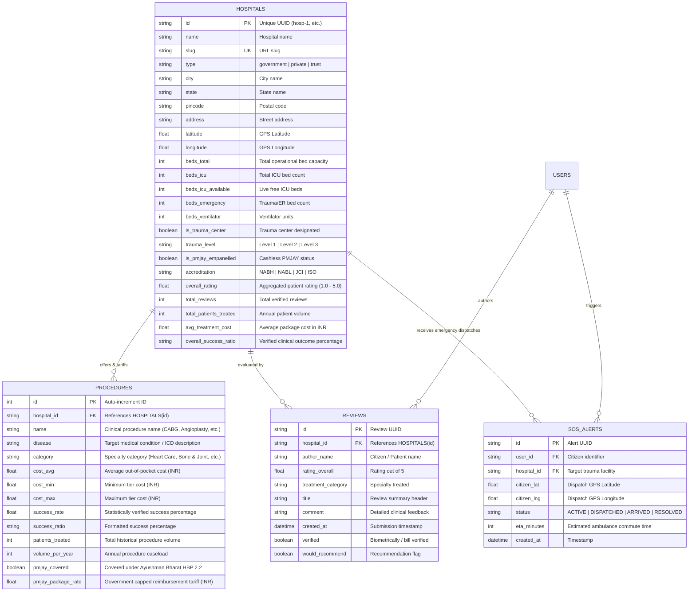

# 🗄️ Med Route — Database Architecture & Data Catalog

> **Reference Specification for TECHNOVA 2026 Hackathon Judges**  
> Comprehensive data dictionary, Entity-Relationship (ER) model, schema definitions, and dataset provenance for the Med Route platform.

---

## 📊 Dataset Overview & Statistics

The Med Route database is a normalized, clinical-grade registry covering primary, secondary, tertiary, and quaternary healthcare institutions across India, aligned with the **National Health Authority (NHA)** and **Ayushman Bharat (AB-PMJAY HBP 2.2)** benefit schedules.

| Metric | Database Count | Description |
|---|---|---|
| **Total Registered Facilities** | **1,451 Institutions** | Verified government, private, and charitable trust hospitals |
| **Geographic Coverage** | **107 Cities** across India | Focus on Tricity (Chandigarh, Mohali, Panchkula), Punjab, Haryana, and NCR |
| **Total Monitored ICU Beds** | **91,398 Beds** | Live telemetry tracking total, emergency, and available critical care capacity |
| **Active Available ICU Beds** | **10,880 Beds** | Real-time free bed inventory updated via telemetry |
| **Verified Procedure Tariffs** | **8,481 Procedure Packages** | Cost benchmarks, annual patient volume, and clinical success ratios |
| **PMJAY Empanelled Facilities** | **1,087 Facilities (75%)** | Institutions supporting 100% cashless treatment under Ayushman Bharat |
| **Patient Verified Reviews** | **4,350+ Clinical Reviews** | Quality ratings, departmental feedback, and wait time logs |

---

## 📐 Entity-Relationship (ER) Diagram



---

## 🏛️ Schema Definitions (SQLAlchemy 2.0 ORM Models)

The production database is managed via SQLAlchemy 2.0 and Alembic. The core tables are defined in:
- [`backend/app/models/hospital.py`](file:///a:/projects/med-route/backend/app/models/hospital.py) — Facility profiles, bed telemetry, accreditations, and PostGIS geometry.
- [`backend/app/models/hospital_procedure.py`](file:///a:/projects/med-route/backend/app/models/hospital_procedure.py) — Procedure mappings, volume, outcomes, and PMJAY rates.
- [`backend/app/models/procedure.py`](file:///a:/projects/med-route/backend/app/models/procedure.py) — Standardized NHA procedure dictionary.
- [`backend/app/models/review.py`](file:///a:/projects/med-route/backend/app/models/review.py) — Patient outcome reviews and verification flags.
- [`backend/app/models/sos_alert.py`](file:///a:/projects/med-route/backend/app/models/sos_alert.py) — Emergency dispatch telemetry.

---

## 📋 Sample Records from the Database

### Sample 1: Apex Regional Government Institution
```json
{
  "id": "hosp-1",
  "name": "PGIMER Chandigarh",
  "slug": "pgimer-chandigarh",
  "type": "government",
  "city": "Chandigarh",
  "state": "Chandigarh",
  "latitude": 30.7650,
  "longitude": 76.7810,
  "beds_total": 1948,
  "beds_icu": 220,
  "beds_icu_available": 14,
  "beds_emergency": 120,
  "is_trauma_center": true,
  "trauma_level": "Level 1",
  "is_pmjay_empanelled": true,
  "accreditation": "NABH Digital & NABL Accredited",
  "overall_rating": 4.8,
  "total_reviews": 642,
  "cost_range": "100% Free with PMJAY (₹15,000 – ₹45,000 subsidized)",
  "specialties": [
    "Emergency & Trauma",
    "Heart Care",
    "Nephrology & Kidney Care",
    "Bone & Joint",
    "Oncology & Cancer Care"
  ],
  "sample_procedure": {
    "name": "Coronary Artery Bypass Graft (CABG)",
    "cost_avg": 45000,
    "pmjay_package_rate": 130000,
    "pmjay_covered": true,
    "volume_per_year": 1250,
    "success_ratio": "98.4%"
  }
}
```

### Sample 2: Quaternary Private Multi-Specialty
```json
{
  "id": "hosp-12",
  "name": "Max Super Speciality Hospital Mohali",
  "slug": "max-super-speciality-mohali",
  "type": "private",
  "city": "Mohali",
  "state": "Punjab",
  "latitude": 30.7258,
  "longitude": 76.7180,
  "beds_total": 240,
  "beds_icu": 45,
  "beds_icu_available": 8,
  "beds_emergency": 25,
  "is_trauma_center": true,
  "trauma_level": "Level 1",
  "is_pmjay_empanelled": true,
  "accreditation": "NABH & JCI Accredited",
  "overall_rating": 4.6,
  "cost_range": "₹85,000 – ₹2,40,000 (PMJAY Cashless Eligible)",
  "sample_procedure": {
    "name": "Coronary Angioplasty (Single Stent)",
    "cost_avg": 95000,
    "pmjay_package_rate": 65000,
    "pmjay_covered": true,
    "volume_per_year": 820,
    "success_ratio": "97.8%"
  }
}
```

---

## 🔍 How Judges Can View & Query the Database

### Method 1: In the Repository (Web Browser on GitHub)
- **Database Architecture Document**: [`DATABASE.md`](DATABASE.md) *(This file)*
- **ORM Table Models**: [`backend/app/models/`](backend/app/models/)
- **Raw Master JSON Dataset (7.8 MB)**: [`backend/app/data_pipeline/allHospitals.json`](backend/app/data_pipeline/allHospitals.json)

---

### Method 2: Via Interactive Swagger API (`/docs`)
When running the FastAPI backend:
1. Open **`http://localhost:8000/docs`**
2. Expand **`GET /api/hospitals`** and click **Try it out** $\rightarrow$ **Execute**
3. View paginated records, filters, and JSON response models directly in Swagger.

---

### Method 3: Via Local SQLite Database (`backend/medroute.db`)
A relational SQLite build of the entire database is generated locally:
```bash
# Query Chandigarh hospitals with available ICU beds
python -c "import sqlite3; conn = sqlite3.connect('backend/medroute.db'); cur = conn.cursor(); [print(f'• {r[0]:<35} | {r[1]:<12} | ICU Free: {r[2]}') for r in cur.execute('SELECT name, city, beds_icu_available FROM hospitals WHERE city=\"Chandigarh\" LIMIT 10').fetchall()]"
```

---

### Method 4: Via Production PostgreSQL + PostGIS (Docker)
When running the full microservice stack (`docker compose up db`):
```bash
docker exec -it medroute-db psql -U medroute -d medroute -c "SELECT name, city, beds_icu_available, is_pmjay_empanelled FROM hospitals WHERE beds_icu_available > 5 LIMIT 10;"
```
