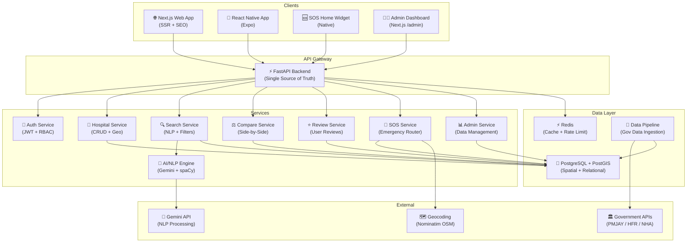
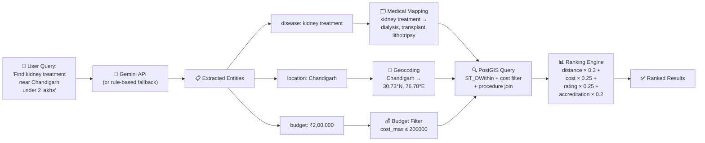
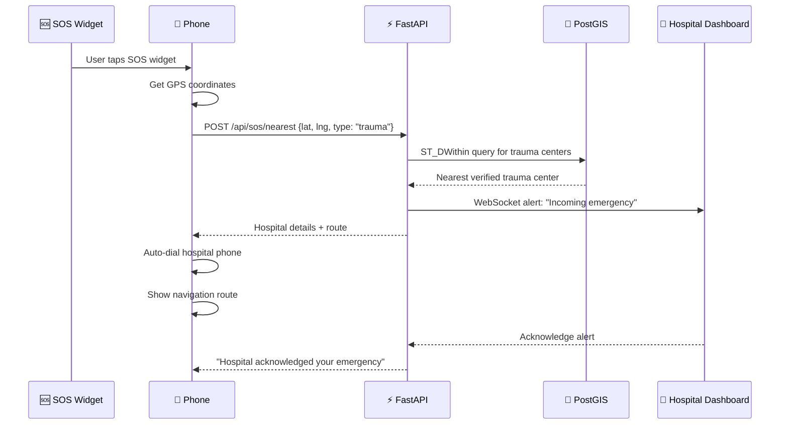

# Med Route — Implementation Plan

> A trustworthy, AI-powered hospital discovery and comparison platform that helps Indian citizens find the right hospital by disease, cost, and location.

## Problem Statement

Citizens struggle to find the right hospitals for specific conditions because information is fragmented, inconsistent, and hard to compare. Med Route surfaces hospital options by **disease**, **cost**, and **location** — with AI-powered natural language search, transparent comparisons, user reviews, and a zero-friction SOS emergency router.

---

## Tech Stack Decision

| Layer | Technology | Rationale |
|---|---|---|
| **Backend API** | Python 3.12 + FastAPI | Native AI/ML ecosystem, async support, auto-generated OpenAPI docs, Pydantic type safety |
| **Database** | PostgreSQL 16 + PostGIS | Geospatial queries (`ST_DWithin` for radius search), ACID compliance, battle-tested |
| **ORM** | SQLAlchemy 2.0 + GeoAlchemy2 | Async support, spatial column types, Alembic migrations |
| **Search** | PostgreSQL Full-Text Search + `pg_trgm` | Good enough to start; upgrade path to Elasticsearch later |
| **Cache** | Redis | Fast query caching, rate limiting, session store |
| **AI/NLP** | Google Gemini API + spaCy (fallback) | Gemini for intent/entity extraction from natural language; spaCy as offline fallback |
| **Web Frontend** | Next.js 15 (App Router) + TypeScript | SSR for SEO, App Router for modern patterns, great DX |
| **Styling** | Vanilla CSS (design-system driven) | Maximum control, no framework overhead, CSS custom properties |
| **Maps** | Leaflet + OpenStreetMap | Free, no API key needed, great for India coverage |
| **Charts** | Recharts | React-native charting for comparisons |
| **Mobile App** | React Native (Expo SDK 52) | Cross-platform, TypeScript, shared patterns with web |
| **SOS Widget** | `react-native-android-widget` + `expo-widgets` | Home screen widget for instant emergency routing |
| **Auth** | JWT (access + refresh tokens) + bcrypt | Stateless auth, secure password hashing |
| **Containerization** | Docker + Docker Compose | Reproducible dev/prod environments |
| **Data Pipeline** | Python ETL scripts + APScheduler | Scheduled ingestion from government sources |

---

## User Review Required

> [!IMPORTANT]
> **Data Provenance**: Since direct PMJAY API access requires ABDM registration, I will:
> 1. Build the full ETL pipeline architecture that connects to real government sources (HFR, PMJAY portal)
> 2. Ship **realistic seed data** (50+ hospitals across Punjab/Haryana/Delhi) based on real PMJAY HBP package structures — clearly labeled as `[SIMULATED]` in every record
> 3. Include a scraper module targeting `hospitals.pmjay.gov.in` structure
> 4. Document exactly how to swap in real data once ABDM credentials are obtained

> [!WARNING]  
> **Mobile SOS Widget**: The home-screen widget requires a **Development Build** (EAS Build), not Expo Go. Background location needs "Always" permission. I'll implement the full architecture but the widget will need physical device testing.

> [!IMPORTANT]
> **AI Search**: I'll use Google Gemini API for NLP query parsing. You'll need a Gemini API key. The system includes a **rule-based fallback parser** that works without any API key for demos.

---

## Open Questions

> [!IMPORTANT]
> 1. **Gemini API Key** — Do you already have a Google Gemini API key, or should I implement the system to work purely with the offline rule-based NLP parser for now?
> 2. **Deployment Target** — Are you planning to deploy this (e.g., Vercel + Railway/Render), or is this for local demo / code evaluation only?
> 3. **Mobile Priority** — Should I build the React Native app with full parity to web, or focus on the SOS widget + core search as the mobile MVP?

---

## Architecture



---

## Data Model

```mermaid
erDiagram
    USERS {
        uuid id PK
        string name
        string email UK
        string phone
        string password_hash
        enum role "citizen | admin | hospital_staff"
        float latitude
        float longitude
        timestamp created_at
    }

    HOSPITALS {
        uuid id PK
        string name
        string slug UK
        enum type "government | private | trust"
        string address
        string city
        string state
        string pincode
        geography location "PostGIS POINT"
        string phone
        string email
        string website
        int beds_total
        int beds_icu
        int beds_emergency
        boolean is_trauma_center
        boolean is_pmjay_empanelled
        string accreditation "NABH | NABL | JCI"
        float overall_rating
        int total_reviews
        boolean verified
        uuid data_source_id FK
        timestamp created_at
    }

    PROCEDURES {
        uuid id PK
        string name
        string icd_code
        string procedure_code
        string hbp_package_code
        enum category "cardiac | renal | ortho | neuro | oncology..."
        text description
        string[] aliases "kidney treatment, dialysis, etc."
    }

    HOSPITAL_PROCEDURES {
        uuid id PK
        uuid hospital_id FK
        uuid procedure_id FK
        int cost_min
        int cost_max
        int cost_avg
        float success_rate
        int volume_per_year
        string data_source_label "SIMULATED | PMJAY_HBP | MANUAL"
        timestamp last_updated
    }

    FACILITIES {
        uuid id PK
        uuid hospital_id FK
        string name "MRI | CT Scan | Blood Bank..."
        enum category "diagnostic | surgical | support"
        boolean is_available
    }

    DEPARTMENTS {
        uuid id PK
        uuid hospital_id FK
        string name
        string head_doctor
        string[] specializations
    }

    REVIEWS {
        uuid id PK
        uuid hospital_id FK
        uuid user_id FK
        int rating "1-5"
        string title
        text content
        string treatment_received
        int cost_transparency_rating "1-5"
        boolean would_recommend
        boolean verified_visit
        int helpful_count
        timestamp created_at
    }

    SOS_ALERTS {
        uuid id PK
        uuid user_id FK
        uuid hospital_id FK
        float user_lat
        float user_lng
        enum alert_type "trauma | cardiac | stroke | general"
        enum status "sent | acknowledged | dispatched"
        timestamp created_at
        timestamp responded_at
    }

    DATA_SOURCES {
        uuid id PK
        string name
        string url
        enum type "government | scraped | manual | simulated"
        int record_count
        timestamp last_synced
    }

    HOSPITALS ||--o{ HOSPITAL_PROCEDURES : offers
    PROCEDURES ||--o{ HOSPITAL_PROCEDURES : offered_at
    HOSPITALS ||--o{ FACILITIES : has
    HOSPITALS ||--o{ DEPARTMENTS : contains
    HOSPITALS ||--o{ REVIEWS : receives
    USERS ||--o{ REVIEWS : writes
    USERS ||--o{ SOS_ALERTS : triggers
    HOSPITALS ||--o{ SOS_ALERTS : receives
    DATA_SOURCES ||--o{ HOSPITALS : sources
```



---

## Proposed Changes

### Phase 1 — Backend Foundation

The backend is the single source of truth. Every client (web, mobile, admin) talks to this API.

---

#### [NEW] `backend/app/main.py`
FastAPI application entry point — mounts all routers, configures CORS, middleware, lifespan events (DB pool, Redis connection, AI model warm-up).

#### [NEW] `backend/app/config.py`
Environment configuration using Pydantic `BaseSettings` — DATABASE_URL, REDIS_URL, GEMINI_API_KEY, JWT_SECRET, etc.

#### [NEW] `backend/app/database.py`
Async SQLAlchemy engine + session factory. Connection pooling. PostGIS extension initialization.

---

#### [NEW] `backend/app/models/user.py`
SQLAlchemy model for users — id, name, email, password_hash, role (citizen/admin/hospital_staff), location.

#### [NEW] `backend/app/models/hospital.py`
Hospital model with PostGIS `Geography(POINT)` column for spatial queries. All hospital metadata.

#### [NEW] `backend/app/models/procedure.py`
Normalized procedure catalog with ICD codes, HBP package codes, categories, and search aliases.

#### [NEW] `backend/app/models/hospital_procedure.py`
Junction table linking hospitals to procedures — with cost ranges, success rates, volume, and **data_source_label** for provenance.

#### [NEW] `backend/app/models/facility.py`
Hospital facilities (MRI, CT, ICU, Blood Bank, etc.) with availability status.

#### [NEW] `backend/app/models/department.py`
Hospital departments with specializations.

#### [NEW] `backend/app/models/review.py`
User reviews with rating, cost transparency score, verified visit flag, helpful count.

#### [NEW] `backend/app/models/sos_alert.py`
Emergency SOS alert records — user location, target hospital, alert status lifecycle.

#### [NEW] `backend/app/models/data_source.py`
Data provenance tracking — every record knows where it came from.

---

#### [NEW] `backend/app/schemas/` (one file per domain)
Pydantic request/response schemas for type-safe API contracts:
- `hospital.py` — HospitalCreate, HospitalResponse, HospitalListResponse
- `search.py` — NLSearchRequest, SearchFilters, SearchResponse
- `review.py` — ReviewCreate, ReviewResponse
- `sos.py` — SOSRequest, SOSResponse
- `auth.py` — LoginRequest, RegisterRequest, TokenResponse
- `compare.py` — CompareRequest, CompareResponse

---

#### [NEW] `backend/app/routers/auth.py`
`/api/auth/*` — Register, login, refresh token, get current user.

#### [NEW] `backend/app/routers/hospitals.py`
`/api/hospitals/*` — List (with geo filters), get by slug, nearby hospitals, hospital details.

#### [NEW] `backend/app/routers/search.py`
`/api/search/*` — Natural language search endpoint, structured search, autocomplete.

#### [NEW] `backend/app/routers/compare.py`
`/api/compare/*` — Side-by-side comparison of 2-4 hospitals.

#### [NEW] `backend/app/routers/reviews.py`
`/api/reviews/*` — Create review, list reviews for hospital, mark helpful, admin moderate.

#### [NEW] `backend/app/routers/sos.py`
`/api/sos/*` — Emergency nearest-hospital lookup, alert dispatch, alert status update.

#### [NEW] `backend/app/routers/admin.py`
`/api/admin/*` — Upload hospital records (CSV/JSON), review queue, verify hospitals, data source management.

---

#### [NEW] `backend/app/services/hospital_service.py`
Business logic for hospital CRUD, geospatial queries using PostGIS `ST_DWithin`, ranking algorithm.

#### [NEW] `backend/app/services/search_service.py`
Orchestrates AI-powered search: receives NL query → calls AI engine → converts to SQL filters → returns ranked results.

#### [NEW] `backend/app/services/ranking_service.py`
Transparent ranking algorithm — weighted score from: distance, cost, success rate, accreditation, reviews. All weights are exposed to the user.

#### [NEW] `backend/app/services/compare_service.py`
Fetches and normalizes data for side-by-side comparison — handles missing data gracefully.

#### [NEW] `backend/app/services/review_service.py`
Review CRUD with anti-spam checks, helpful vote management, average rating recalculation.

#### [NEW] `backend/app/services/sos_service.py`
Emergency routing — finds nearest trauma center using PostGIS, dispatches alert, tracks response lifecycle.

#### [NEW] `backend/app/services/admin_service.py`
Bulk data upload (CSV/JSON parsing), hospital verification workflow, data quality checks.

---

#### [NEW] `backend/app/ai/nlp_parser.py`
**Core AI engine** — Takes natural language query, returns structured `SearchFilters`:
```python
# Input:  "Find kidney treatment hospital near Chandigarh under 2 lakhs rs"
# Output: SearchFilters(
#     disease="kidney treatment",
#     procedure_category="renal",
#     location="Chandigarh",
#     lat=30.7333, lng=76.7794,
#     max_budget=200000,
#     radius_km=50
# )
```
Uses Gemini API with structured JSON output. Falls back to rule-based parser.

#### [NEW] `backend/app/ai/intent_classifier.py`
Classifies user intent: `hospital_search | procedure_lookup | cost_inquiry | emergency | comparison`.

#### [NEW] `backend/app/ai/entity_extractor.py`
Rule-based fallback entity extractor using regex + medical dictionary for offline operation.

#### [NEW] `backend/app/ai/medical_mappings.py`
Dictionary mapping everyday language to procedure codes: `"kidney treatment" → ["dialysis", "renal_transplant", "lithotripsy"]`.

---

#### [NEW] `backend/app/data_pipeline/seed_data.py`
Generates realistic seed data for 50+ hospitals across Punjab, Haryana, Delhi NCR, Chandigarh. Every record is labeled `[SIMULATED]`. Based on real PMJAY HBP package structure.

#### [NEW] `backend/app/data_pipeline/pmjay_scraper.py`
Scraper targeting `hospitals.pmjay.gov.in` — extracts empanelled hospital lists. Respects rate limits. Documented for future real-data connection.

#### [NEW] `backend/app/data_pipeline/normalizer.py`
Normalizes raw data: standardizes procedure names, maps to ICD codes, geocodes addresses, validates cost ranges.

---

#### [NEW] `backend/app/middleware/auth.py`
JWT token verification middleware with role-based access control (RBAC).

#### [NEW] `backend/app/middleware/rate_limiter.py`
Redis-backed rate limiting — protects API from abuse.

#### [NEW] `backend/app/utils/geo.py`
Geospatial utilities — distance calculation, bounding box generation, geocoding (Nominatim).

#### [NEW] `backend/app/utils/cache.py`
Redis caching decorator for expensive queries (hospital listings, search results).

---

#### [NEW] `backend/requirements.txt`
All Python dependencies with pinned versions.

#### [NEW] `backend/Dockerfile`
Multi-stage Docker build for the FastAPI backend.

#### [NEW] `backend/.env.example`
Documented environment variables template.

#### [NEW] `backend/tests/` (multiple files)
Unit tests for services, integration tests for API endpoints, test fixtures with seed data.

---

### Phase 2 — Web Frontend (Next.js)

Premium, mobile-responsive web interface with SSR for SEO.

---

#### [NEW] `web/src/app/page.tsx`
**Landing page** — Hero section with NL search bar, featured hospitals, quick category cards (Cardiac, Renal, Ortho...), SOS button, trust signals.

#### [NEW] `web/src/app/search/page.tsx`
**Search results page** — AI-parsed query display, filter sidebar (distance, budget, accreditation, type), hospital result cards with map view toggle, sort options.

#### [NEW] `web/src/app/hospital/[slug]/page.tsx`
**Hospital detail page** — Full profile: overview, procedures with costs, facilities grid, department list, reviews section, location map, "Add to Compare" button.

#### [NEW] `web/src/app/compare/page.tsx`
**Comparison page** — Side-by-side table for 2-4 hospitals. Rows: cost, distance, rating, accreditation, facilities, procedures, reviews. Visual indicators for best-in-category.

#### [NEW] `web/src/app/sos/page.tsx`
**SOS emergency page** — Full-screen emergency UI, auto-detects location, shows nearest trauma center, one-tap call, route display.

#### [NEW] `web/src/app/admin/page.tsx`
**Admin dashboard** — Upload CSV/JSON, review hospital queue, verify records, manage data sources, analytics overview.

#### [NEW] `web/src/app/admin/hospitals/page.tsx`
Admin hospital management — CRUD table with inline editing, verification toggle, data source badge.

#### [NEW] `web/src/app/admin/upload/page.tsx`
Admin bulk upload — Drag-and-drop CSV/JSON upload, column mapping preview, validation report, import confirmation.

---

#### [NEW] `web/src/components/ui/` (shared design system)
- `Button.tsx` — Primary, secondary, danger, ghost variants with loading states
- `Input.tsx` — Text input with floating label, search variant with icon
- `Card.tsx` — Hospital card, stat card, comparison card
- `Badge.tsx` — Accreditation, type, rating, data-source badges
- `Modal.tsx` — Confirmation, detail view modals
- `Skeleton.tsx` — Loading skeletons for all card types
- `StarRating.tsx` — Interactive and display star ratings
- `Toast.tsx` — Success/error/info notification toasts

#### [NEW] `web/src/components/search/SearchBar.tsx`
**NL Search Bar** — Full-width input with animated placeholder examples, microphone icon, real-time AI parsing indicator showing extracted filters as colored chips.

#### [NEW] `web/src/components/search/FilterPanel.tsx`
Structured filter sidebar — distance slider, budget range, accreditation checkboxes, hospital type, procedure category.

#### [NEW] `web/src/components/search/SearchResultCard.tsx`
Hospital result card — name, type badge, distance, price range, rating, top procedures, "Compare" checkbox.

#### [NEW] `web/src/components/hospital/HospitalHeader.tsx`
Hospital detail header — name, accreditation badges, rating, type, "Add to Compare" CTA.

#### [NEW] `web/src/components/hospital/ProcedureTable.tsx`
Procedure listing with cost ranges, success rates, sortable columns.

#### [NEW] `web/src/components/hospital/FacilityGrid.tsx`
Visual grid of available facilities with icons and availability status.

#### [NEW] `web/src/components/hospital/ReviewSection.tsx`
Reviews list with rating distribution chart, individual review cards, "Write Review" form.

#### [NEW] `web/src/components/compare/CompareTable.tsx`
Side-by-side comparison table with highlight-best logic and visual indicators.

#### [NEW] `web/src/components/maps/HospitalMap.tsx`
Leaflet map with hospital markers, user location, radius circle, popup cards.

#### [NEW] `web/src/components/maps/RouteMap.tsx`
SOS route display — user to nearest trauma center with distance/ETA.

#### [NEW] `web/src/components/admin/UploadForm.tsx`
CSV/JSON upload with preview, validation, and import progress.

#### [NEW] `web/src/components/admin/HospitalTable.tsx`
Admin data table with sorting, filtering, inline editing, bulk actions.

---

#### [NEW] `web/src/lib/api.ts`
API client — typed fetch wrapper for all backend endpoints. Handles auth tokens, error normalization.

#### [NEW] `web/src/lib/utils.ts`
Shared utilities — currency formatting (₹ lakhs), distance formatting, date formatting.

#### [NEW] `web/src/hooks/useSearch.ts`
Search hook — manages NL query state, debounced API calls, filter sync.

#### [NEW] `web/src/hooks/useGeolocation.ts`
Browser Geolocation API hook — permission handling, fallback to IP-based location.

#### [NEW] `web/src/hooks/useCompare.ts`
Compare state management — add/remove hospitals, max 4, persist to localStorage.

#### [NEW] `web/src/types/index.ts`
Shared TypeScript interfaces mirroring backend Pydantic schemas.

#### [NEW] `web/src/styles/globals.css`
Design system — CSS custom properties (colors, spacing, typography, shadows, animations), responsive breakpoints, dark mode support.

---

### Phase 3 — Mobile App (React Native / Expo)

---

#### [NEW] `mobile/src/screens/HomeScreen.tsx`
Home screen with NL search bar, SOS button (prominent, always accessible), nearby hospitals, quick categories.

#### [NEW] `mobile/src/screens/SearchScreen.tsx`
Search results with filters, map/list toggle.

#### [NEW] `mobile/src/screens/HospitalScreen.tsx`
Hospital detail with all sections, native share, directions integration.

#### [NEW] `mobile/src/screens/CompareScreen.tsx`
Horizontal-scroll comparison table optimized for mobile.

#### [NEW] `mobile/src/screens/SOSScreen.tsx`
Full-screen emergency — auto-location, nearest trauma center, one-tap call, alert dispatch.

#### [NEW] `mobile/src/screens/ReviewScreen.tsx`
Write review form with star rating, treatment details.

#### [NEW] `mobile/src/screens/AdminScreen.tsx`
Simplified admin for hospital staff — view alerts, update status.

---

#### [NEW] `mobile/src/widgets/SOSWidget.tsx`
**Home screen SOS widget** — One-tap emergency button. Uses `react-native-android-widget` (Android) and `expo-widgets` (iOS). Bypasses app UI entirely. Gets current GPS → hits `/api/sos/nearest` → shows hospital + initiates call → fires alert to hospital dashboard.

#### [NEW] `mobile/src/services/api.ts`
Shared API client (mirrors web).

#### [NEW] `mobile/src/services/location.ts`
Background location service using `expo-location` + `expo-task-manager`.

#### [NEW] `mobile/src/navigation/AppNavigator.tsx`
Stack + Tab navigation with SOS always accessible.

---

### Phase 4 — Data Pipeline & AI Training

---

#### [NEW] `backend/app/data_pipeline/hbp_mapper.py`
Maps PMJAY Health Benefit Package codes to normalized procedure catalog. Handles tier-based pricing (X/Y/Z tiers).

#### [NEW] `backend/app/ai/training/prepare_dataset.py`
Generates training data for NLP query parsing — 1000+ example queries with labeled intents and entities.

#### [NEW] `backend/app/ai/training/train_ner.py`
Optional: Trains a custom spaCy NER model on medical terminology specific to Indian healthcare context.

---

### Phase 5 — Documentation & Polish

---

#### [NEW] `README.md`
**Comprehensive README** with:
- Project overview + problem statement
- Architecture diagram
- Tech stack justification
- Setup instructions (Docker + manual)
- API documentation link
- Screenshots / demo GIF
- Data provenance disclosure
- Contributing guidelines
- License

#### [NEW] `docs/architecture.md`
Detailed architecture documentation with data flow diagrams.

#### [NEW] `docs/api-reference.md`
API endpoint documentation (auto-generated from FastAPI OpenAPI schema + examples).

#### [NEW] `docs/data-dictionary.md`
Complete data model documentation with field descriptions, relationships, and provenance labels.

---

## Project Structure

```
med-route/
├── backend/                          # 🐍 Python FastAPI Backend
│   ├── app/
│   │   ├── __init__.py
│   │   ├── main.py                   # App entry point, router mounting
│   │   ├── config.py                 # Environment configuration
│   │   ├── database.py               # Async SQLAlchemy setup
│   │   ├── models/                   # SQLAlchemy models (1 file per entity)
│   │   │   ├── __init__.py
│   │   │   ├── user.py
│   │   │   ├── hospital.py
│   │   │   ├── procedure.py
│   │   │   ├── hospital_procedure.py
│   │   │   ├── facility.py
│   │   │   ├── department.py
│   │   │   ├── review.py
│   │   │   ├── sos_alert.py
│   │   │   └── data_source.py
│   │   ├── schemas/                  # Pydantic schemas (1 file per domain)
│   │   │   ├── __init__.py
│   │   │   ├── auth.py
│   │   │   ├── hospital.py
│   │   │   ├── search.py
│   │   │   ├── compare.py
│   │   │   ├── review.py
│   │   │   └── sos.py
│   │   ├── routers/                  # API route handlers (1 file per feature)
│   │   │   ├── __init__.py
│   │   │   ├── auth.py
│   │   │   ├── hospitals.py
│   │   │   ├── search.py
│   │   │   ├── compare.py
│   │   │   ├── reviews.py
│   │   │   ├── sos.py
│   │   │   └── admin.py
│   │   ├── services/                 # Business logic (1 file per domain)
│   │   │   ├── __init__.py
│   │   │   ├── hospital_service.py
│   │   │   ├── search_service.py
│   │   │   ├── ranking_service.py
│   │   │   ├── compare_service.py
│   │   │   ├── review_service.py
│   │   │   ├── sos_service.py
│   │   │   └── admin_service.py
│   │   ├── ai/                       # AI/NLP components
│   │   │   ├── __init__.py
│   │   │   ├── nlp_parser.py         # Gemini-powered query parser
│   │   │   ├── intent_classifier.py  # Intent classification
│   │   │   ├── entity_extractor.py   # Rule-based fallback
│   │   │   ├── medical_mappings.py   # Disease → procedure code mappings
│   │   │   └── training/
│   │   │       ├── prepare_dataset.py
│   │   │       └── train_ner.py
│   │   ├── data_pipeline/            # ETL & data ingestion
│   │   │   ├── __init__.py
│   │   │   ├── seed_data.py          # Realistic simulated data generator
│   │   │   ├── pmjay_scraper.py      # Government portal scraper
│   │   │   ├── hbp_mapper.py         # HBP package code mapper
│   │   │   └── normalizer.py         # Data normalization engine
│   │   ├── middleware/
│   │   │   ├── auth.py               # JWT verification + RBAC
│   │   │   └── rate_limiter.py       # Redis-backed rate limiting
│   │   └── utils/
│   │       ├── geo.py                # Geospatial utilities
│   │       └── cache.py              # Redis caching decorator
│   ├── migrations/                   # Alembic migrations
│   ├── tests/                        # Pytest test suite
│   │   ├── test_hospitals.py
│   │   ├── test_search.py
│   │   ├── test_sos.py
│   │   └── test_ai.py
│   ├── requirements.txt
│   ├── Dockerfile
│   ├── .env.example
│   └── alembic.ini
│
├── web/                              # ⚡ Next.js Web Frontend
│   ├── src/
│   │   ├── app/                      # App Router pages
│   │   │   ├── layout.tsx
│   │   │   ├── page.tsx              # Landing page
│   │   │   ├── search/page.tsx       # Search results
│   │   │   ├── hospital/[slug]/page.tsx  # Hospital detail
│   │   │   ├── compare/page.tsx      # Comparison
│   │   │   ├── sos/page.tsx          # Emergency SOS
│   │   │   └── admin/
│   │   │       ├── page.tsx          # Admin dashboard
│   │   │       ├── hospitals/page.tsx
│   │   │       └── upload/page.tsx
│   │   ├── components/
│   │   │   ├── ui/                   # Design system components
│   │   │   ├── search/               # Search feature components
│   │   │   ├── hospital/             # Hospital feature components
│   │   │   ├── compare/              # Compare feature components
│   │   │   ├── maps/                 # Map components
│   │   │   └── admin/                # Admin components
│   │   ├── hooks/                    # Custom React hooks
│   │   ├── lib/                      # API client, utilities
│   │   ├── types/                    # TypeScript interfaces
│   │   └── styles/
│   │       └── globals.css           # Design system + global styles
│   ├── public/
│   ├── next.config.js
│   ├── tsconfig.json
│   ├── package.json
│   └── Dockerfile
│
├── mobile/                           # 📱 React Native (Expo) App
│   ├── src/
│   │   ├── screens/                  # App screens
│   │   ├── components/               # Shared mobile components
│   │   ├── widgets/                  # SOS home screen widget
│   │   ├── services/                 # API + location services
│   │   ├── navigation/              # React Navigation setup
│   │   └── hooks/                    # Custom hooks
│   ├── app.json
│   ├── App.tsx
│   └── package.json
│
├── docker-compose.yml                # Full stack orchestration
├── README.md                         # Comprehensive project documentation
└── docs/
    ├── architecture.md
    ├── api-reference.md
    └── data-dictionary.md
```

---

## AI NLP Search — How It Works

The NLP search pipeline transforms everyday language into structured database queries:



---

## Ranking Algorithm (Transparent)

Every search result includes a breakdown of its ranking score, so users understand WHY a hospital is ranked where it is:

| Factor | Weight | How It's Calculated |
|---|---|---|
| **Distance** | 30% | Inverse distance from user (closer = higher score) |
| **Cost Match** | 25% | How well the hospital's pricing fits the budget |
| **User Rating** | 25% | Weighted average of verified reviews |
| **Accreditation** | 20% | NABH > NABL > None; PMJAY empanelment bonus |

Weights are displayed alongside results. Users can adjust weights via sliders on the search page.

---

## SOS Emergency Flow



---

## Verification Plan

### Automated Tests
```bash
# Backend unit + integration tests
cd backend && pytest tests/ -v --cov=app

# Lint + type checking
mypy app/ --strict
ruff check app/

# Frontend build verification
cd web && npm run build

# Mobile type checking
cd mobile && npx tsc --noEmit
```

### Manual Verification
1. **NLP Search**: Test with 10+ natural language queries in English and Hinglish
2. **Geospatial**: Verify distance calculations match Google Maps within 5% margin
3. **Comparison**: Compare 4 hospitals side-by-side, verify data consistency
4. **SOS**: Test on physical Android device with home screen widget
5. **Admin Upload**: Upload test CSV, verify data appears correctly
6. **Mobile Responsiveness**: Test web on Chrome DevTools mobile viewports
7. **API Docs**: Verify auto-generated Swagger docs at `/docs`

---

## Execution Order

| Phase | What | Est. Files |
|---|---|---|
| **1** | Backend: Models, Database, Config, Auth | ~20 files |
| **2** | Backend: Services, Routers, API endpoints | ~15 files |
| **3** | Backend: AI/NLP engine + seed data | ~10 files |
| **4** | Web: Design system + Landing page | ~12 files |
| **5** | Web: Search, Hospital detail, Compare | ~15 files |
| **6** | Web: Admin dashboard, SOS page | ~10 files |
| **7** | Mobile: Core screens + navigation | ~12 files |
| **8** | Mobile: SOS widget + background location | ~5 files |
| **9** | Docker, README, docs, tests | ~10 files |
| | **Total** | **~109 files** |
